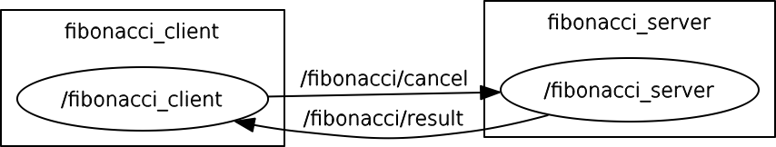

# Exercise 2.1.3: Running an Action Client and Server

## 1. Action Feedback
Run the Action server (C++ | Python) and client (C++ | Python), along with roscore.   
In a new terminal, rostopic the feedback channel to see the feedback from the action server:
```
$ rostopic echo /fibonacci/feedback
```
While the server is acting on the goal you will see something similar to: 
```
header: 
  seq: 11
  stamp: 
    secs: 1493348269
    nsecs: 641851713
  frame_id: ''
status: 
  goal_id: 
    stamp: 
      secs: 1493348258
      nsecs: 640224831
    id: /fibonacci_client-1-1493348258.640224831
  status: 1
  text: This goal has been accepted by the simple action server
feedback: 
  sequence: [0, 1, 1, 2, 3, 5, 8, 13, 21, 34, 55, 89, 144, 233]
---
header: 
  seq: 12
  stamp: 
    secs: 1493348270
    nsecs: 641755588
  frame_id: ''
status: 
  goal_id: 
    stamp: 
      secs: 1493348258
      nsecs: 640224831
    id: /fibonacci_client-1-1493348258.640224831
  status: 1
  text: This goal has been accepted by the simple action server
feedback: 
  sequence: [0, 1, 1, 2, 3, 5, 8, 13, 21, 34, 55, 89, 144, 233, 377]
---
header: 
  seq: 13
  stamp: 
    secs: 1493348271
    nsecs: 641764829
  frame_id: ''
status: 
  goal_id: 
    stamp: 
      secs: 1493348258
      nsecs: 640224831
    id: /fibonacci_client-1-1493348258.640224831
  status: 1
  text: This goal has been accepted by the simple action server
feedback: 
  sequence: [0, 1, 1, 2, 3, 5, 8, 13, 21, 34, 55, 89, 144, 233, 377, 610]
```

## 2. Action Result
In a new terminal, rostopic the feedback channel to see the feedback from the action server: 
```
$ rostopic echo /fibonacci/result
```
After the goal is completed you will see something similar to:
```
header: 
  seq: 1
  stamp: 
    secs: 1493348431
    nsecs:  92584155
  frame_id: ''
status: 
  goal_id: 
    stamp: 
      secs: 1493348411
      nsecs:  90424847
    id: /fibonacci_client-1-1493348411.90424847
  status: 3
  text: ''
result: 
  sequence: [0, 1, 1, 2, 3, 5, 8, 13, 21, 34, 55, 89, 144, 233, 377, 610, 987, 1597, 2584, 4181, 6765, 10946]
```

### rqt_graph
 
