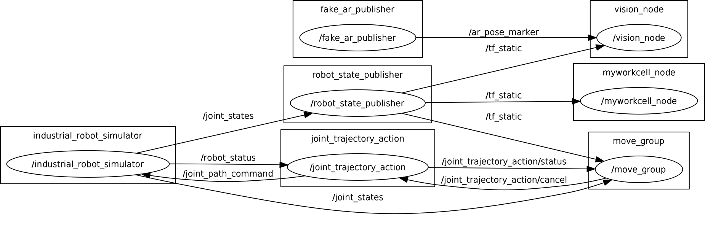

# Exercise 4.0: Motion Planning using C++

## myworkcell_node.cpp

* Edit myworkcell_node.cpp to flip the target pose by 180 to create the desired tool pose.
* Add #include <tf/tf.h> to allow access to the tf library (for frame transforms/utilities).
* Remember that we already added a dependency on the tf package in a previous exercise.
* Create a helper function flipPose() in the ScanNPlan class to flip the reported part frame.
```
geometry_msgs::Pose flipPose(const geometry_msgs::Pose& in) const
{
  tf::Transform in_tf; 
  tf::poseMsgToTF(in, in_tf);
  tf::Quaternion flip_rot(tf::Vector3(1, 0, 0), M_PI);
  tf::Transform flipped = in_tf * tf::Transform(flip_rot); 
  geometry_msgs::Pose out; 
  tf::poseTFToMsg(flipped, out);
  return out;
}
```
* In the ScanNPlan class's start method, use the flipPose method to flip the response from the LocalizePart service into a new move_target variable:
```
geometry_msgs::Pose move_target = flipPose(srv.response.pose);
```
* Use the MoveGroupInterface to plan/execute a move to the move_target position:
* The MoveGroupInterface is part of the moveit_ros_planning_interface package, so you’ll need to add this as a dependency to your myworkcell_core package. Modify your package's CMakeLists.txt (2 lines) and package.xml (2 lines) as in previous exercises.
* Add the appropriate "include" reference to allow use of the MoveGroup:
```
#include <moveit/move_group_interface/move_group.h>
```
* Create a moveit::planning_interface::MoveGroup object in the ScanNPlan class's start() method. It has a single constructor that takes the name of the planning group you defined when creating the workcell moveit package (“manipulator”).
```
moveit::planning_interface::MoveGroup move_group("manipulator");
```
* Set the desired cartesian target position using the move_group object’s setPoseTarget function. Call the object's move() function to plan and execute a move to the target position.
```
// Plan for robot to move to part
move_group.setPoseTarget(move_target); 
move_group.move();
```
* Edit myworkcell_node.cpp, in the main() routine:
* Add below private node-handle definition: ros::AsyncSpinner async_spinner(1);
* Add above app.start(base_frame): async_spinner.start();
* replace ros::spin() with ros::waitForShutdown();
```
int main(int argc, char **argv)
{
    ros::init(argc, argv, "myworkcell_node");
    ros::NodeHandle nh;
    ros::NodeHandle private_node_handle ("~");
    std::string base_frame;

    /// parameter name, string object reference, default value
    private_node_handle.param<std::string>("base_frame", base_frame, "world"); 
    ros::AsyncSpinner async_spinner(1);
    
    ROS_INFO("ScanNPlan node has been initialized");

    ScanNPlan app(nh);

    ros::Duration(.5).sleep();  // wait for the class to initialize
    async_spinner.start();
    app.start(base_frame);

    //~ ros::spin();  
    ros::waitForShutdown(); 
}
```

* Test the system
```
$ catkin_make
$ roslaunch myworkcell_moveit_config myworkcell_planning_execution.launch
$ roslaunch myworkcell_support workcell.launch
```

## workcell.xacro
* Edit workcell.xacro and change the world_to_camera orientation to use a rotation of 3.14159 (instead of 1.57). This points the camera down (at the table), rather than sideways.
```
    <joint name="world_to_camera" type="fixed">
        <parent link="world"/>
        <child link="camera_frame"/> 
        <origin xyz="0 0 1.0" rpy="0 3.14159 0"/>
    </joint>
```

## fake_ar_publisher.cpp
* Edit fake_ar_publisher.cpp and change lines 70-72 to use an offset of (-0.5, 0.0, 0.5), not (0,0,0.5). This points the box offset from the camera centerline

## rqt_graph
 


## More to explore ...

* Add a "Marker" display of topic "/ar_pose_visual" to confirm that the final robot position matches the position published by fake_ar_publisher
* Try repeating the motion planning sequence:
    * Use the MoveIt rviz interface to move the arm back to the "allZeros" position
    * Ctrl+C the workcell.launch file, then rerun
* Try updating the workcell_node's start method to automatically move back to the allZeros position after moving to the AR_target position. See here for a list of move_group's available methods.
* Try moving to an "approach position" located a few inches away from the target position, prior to the final move-to-target.
